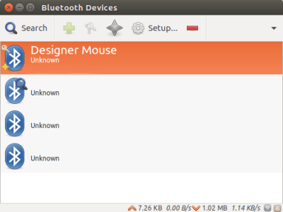

# Ubuntu 16.04 BT KB/MS setting
## 2018-02-02

## 1).Clear BT setting & install some package
    cd /usr/share/upstart/sessions

    sudo mv indicator-bluetooth.conf indicator-bluetooth.conf.old

    sudo apt install blueman bluez
## 2).Then, we have to do the following:
modify some files

	sudo nano /etc/bluetooth/main.conf
    Change line 67, uncomment #[Policy] so that it reads [Policy]
    Change line 89, uncomment and change #AutoEnable=false so that it reads
    AutoEnable=true
## 3).doing other setting
Now we open the HCI rules and comment it to turn it off.

	sudo nano /lib/udev/rules.d/50-bluetooth-hci-auto-poweron.rules

Comment the line (put a # at the beginning) so it reads

    #ACTION=="add", SUBSYSTEM=="bluetooth", KERNEL=="hci[0-9]*", RUN+="/bin/hciconfig %k up"

## 4). Click Bluetooth Manager
Now you should be able to Setup New Device

You’ll have to hold the button on the bottom of the mouse until the blue light blinks on and off, this puts it into pairing mode. Once paired, you’ll see it in Devices.

Highlight it and right-click the device entry for Designer Mouse and choose Trust.

## 5).Ref site
1). https://www.ianthurston.com/fixes/ubuntu-designer-mouse-inspiron/
2). https://askubuntu.com/questions/777199/bluetooth-le-and-ubuntu-16-04-sometimes-works-other-times-not
3). http://forum.ubuntu.org.cn/viewtopic.php?f=54&t=483706&p=3189871